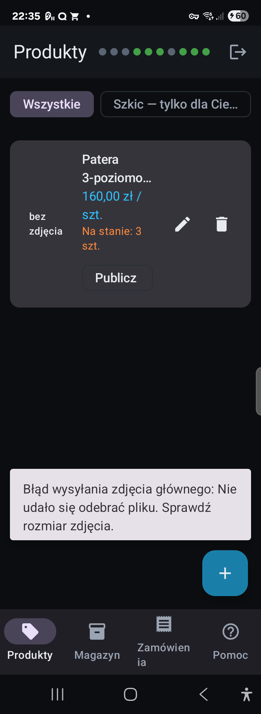
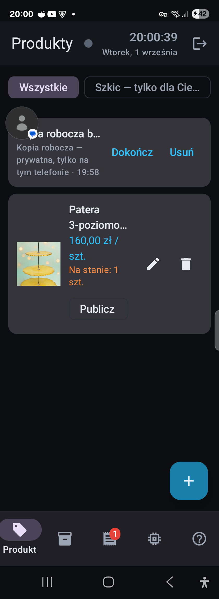
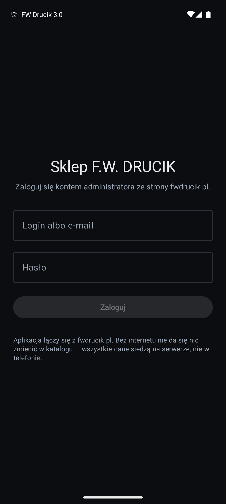
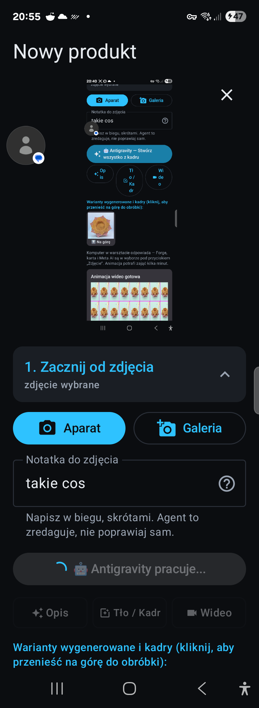
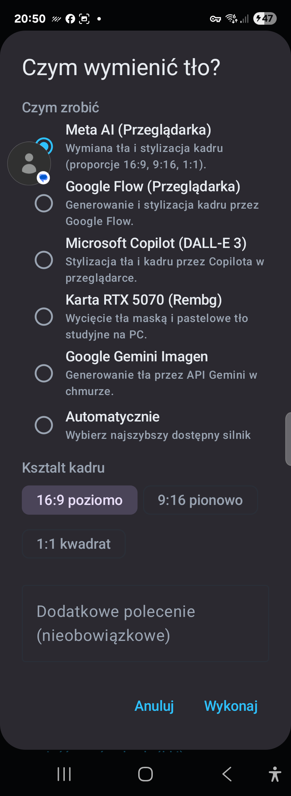
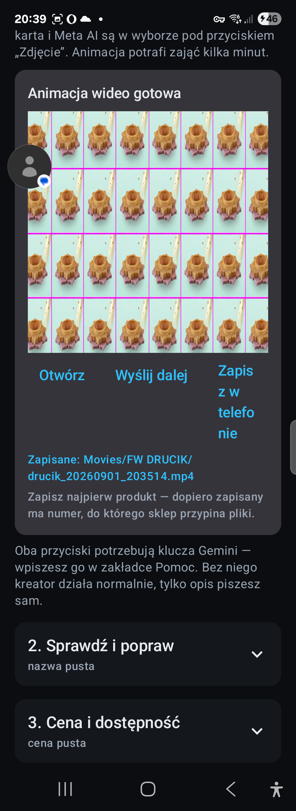

# 🛒 F.W. DRUCIK Sklep — Mobilne Centrum Zarządzania & Asystent AI

[](https://kotlinlang.org)
[-green.svg?logo=android)](https://developer.android.com)
[](https://developer.android.com/jetpack/compose)
[](#-hub-wielomodelowy-ai-w-kreatorze)
[](https://github.com/fwdrucik/FWDrucikSklep)

> **Dedykowana aplikacja na Androida do kompleksowej obsługi sklepu internetowego [fwdrucik.pl](https://fwdrucik.pl) bezpośrednio ze stołu warsztatowego — z wbudowanym wielomodelowym agentem AI.**

---

## 🔗 Dokumentacja Projektu na GitHubie

- 📖 **Główna dokumentacja (README):** [https://github.com/fwdrucik/FWDrucikSklep#readme](https://github.com/fwdrucik/FWDrucikSklep#readme)
- 🏗️ **Audyt Architektury & Kontrakty API (PHP ↔ Kotlin):** [docs/AUDYT-ARCHITEKTURY.md](docs/AUDYT-ARCHITEKTURY.md)
- 🤖 **Standardy Technologiczne i Reguły Agentów AI:** [AGENTS.md](AGENTS.md)
- 🛡️ **Zasady Bezpieczeństwa, Sesji i Izolacji Klientów:** [CLAUDE.md](CLAUDE.md)
- 🌐 **Sklep produkcyjny online:** [https://fwdrucik.pl](https://fwdrucik.pl)

---

## 📸 Zrzuty Ekranu z Aplikacji

<p align="center">
  
  
  
</p>

<p align="center">
  
  
  
</p>

---

## 💡 Główne Funkcjonalności

Aplikacja rozwiązuje kluczowy problem rzemieślnika i twórcy wyrobów: **dodawanie i edycję produktów bez siadania do komputera**. Wyrób powstaje na warsztacie, kładziesz go na stole, robisz zdjęcie telefonem, a wbudowany agent AI przygotowuje kompletny opis, kadr i publikację w sklepie.

| Moduł | Zastosowanie i możliwości |
|---|---|
| **🏷️ Produkty** | Błyskawiczny przegląd całego asortymentu wraz ze szkicami. Publikowanie, wycofywanie ze sprzedaży (ukrywanie), edycja cen i usuwanie jednym dotknięciem. |
| **📦 Magazyn** | Szybka korekta stanów magazynowych (+, -, wpisanie ilości). Wyróżnienie braków magazynowych oraz stanów krytycznych na górze listy. |
| **📑 Zamówienia** | Pełny podgląd zamówień od klientów: zamawiający, adres wysyłki, pozycje, wybrane płatności i dostawa. Zmiana statusów realizacji (od *nowe* do *zakończone*). |
| **✨ Kreator AI** | Autorski asystent wprowadzania produktów ze zdjęcia (patrz niżej). |
| **🔔 Powiadomienia w tle** | `WorkManager` cyklicznie sprawdza nowe zamówienia i powiadamia dźwiękiem/wibracją o zakupie. |
| **ℹ️ Pomoc & Podpowiedzi** | Kontekstowa baza wiedzy przy każdym polu kreatora (podpowiedzi, przykłady, wymogi prawne i konsumenckie). |

---

## 🤖 Hub Wielomodelowy AI w Kreatorze

Kreator produktów nie jest zwykłym formularzem — został zaprojektowany wokół pracy warsztatowej:

1. **Zdjęcie prosto ze stołu** — pobierane przez aparat lub systemowy `Photo Picker` (aplikacja nie żąda uprawnień do całej pamięci urządzenia).
2. **Szybka notatka głosowa lub tekstowa** — dwa słowa rzucone w biegu (np. *"świecznik kwiat lotosu żywica dąb"*).
3. **Analiza wizualna i redakcja opisu** — model analizuje fizyczne cechy wyrobu i zwraca ustrukturyzowany JSON z nazwą, chwytliwym opisem krótkim, szczegółowym opisem technicznym, kategorią, jednostką miary i opisem alternatywnym (ALT).
4. **Poprawa tła, kadru i światła** — możliwość wyboru silnika obróbki graficznej:
   - **Google Gemini Imagen** — czyste generowanie studyjnego tła w chmurze,
   - **Meta AI** — stylizacja kadru i wymiana tła (16:9, 9:16, 1:1),
   - **Google Flow** — zaawansowana generacja kadrów,
   - **Microsoft Copilot (DALL-E 3)** — kreatywna stylizacja otoczenia wyrobu,
   - **Lokalna karta NVIDIA RTX 5070 (Rembg)** — bezchmurne, superszybkie wycięcie tła na serwerze warsztatowym PC,
   - **Tryb automatyczny** — dobór najszybszego aktualnie dostępnego silnika.
5. **Animacje wideo & GIF** — generowanie animowanych prezentacji obrotowych wyrobu do sklepu i social media (MP4 60FPS / GIF).

### 🛡️ Zasady Etyki i Prawdy Produktowej AI

- **Agent nie zmyśla faktów:** Ma bezwzględny zakaz zgadywania gatunku drewna, wymiarów, stopu stali czy technologii, jeśli nie widać ich jednoznacznie na zdjęciu. Czego nie da się potwierdzić wizualnie, trafia do ramki: *"Tego nie widać na zdjęciu — uzupełnij sam"*. Rzetelność opisu chroni przed reklamacjami.
- **Wyrób pozostaje autentyczny:** Silniki modyfikują tło, wyrównują oświetlenie i kadrują, nie ingerując w fizyczny kształt, strukturę i kolorystykę sprzedawanego rękodzieła.
- **Priorytet pracy ręcznej:** Agent uzupełnia wyłącznie puste pola — nigdy nie nadpisuje wartości wpisanych ręcznie przez administratora.

---

## 🏗️ Architektura & Bezpieczeństwo

```
Aplikacja Android (Kotlin / Compose)
      │
      ├─── [1] OkHttpClient Sklepowy (CookieJar + X-Fw-Csrf) ──► api/sklep.php (fwdrucik.pl)
      │
      ├─── [2] OkHttpClient Gemini (Czysty, brak cookies)   ──► Google Generative AI API
      │
      └─── [3] OkHttpClient Warsztatowy (Timeout 3s)         ──► Serwer Warsztatowy PC (RTX 5070 / Rembg)
```

1. **Zero własnej bazy po stronie telefonu:**
   Aplikacja nie posiada lokalnej bazy Room ani SQLite dla asortymentu — wszystkie operacje realizowane są w czasie rzeczywistym przez `api/sklep.php`. Dzięki temu wyeliminowano problem rozbieżności stanów magazynowych pomiędzy telefonem a stroną www.
2. **Ścisła izolacja klientów HTTP:**
   - Klient sklepowy przesyła bezpieczne ciasteczko sesyjne administratora oraz tokeny CSRF.
   - Klient Gemini wykonuje zapytania bezpośrednio do API Google bez przesyłania jakichkolwiek tokenów sesyjnych sklepu.
   - Klient warsztatowy łączy się w sieci lokalnej z PC wyposażonym w RTX 5070.
3. **Ochrona kluczy i sesji:**
   - Klucz Gemini API przechowywany jest w szyfrowanym `DataStore` na urządzeniu — nie występuje w kodzie źródłowym, commitach ani kopiach chmurowych.
   - Ciasteczko sesji administratora jest jawnie wykluczone z systemowej kopii zapasowej Androida (`reguly_kopii.xml`).

---

## ⚖️ Prawne Aspekty Magazynu & Zwrotów

W aplikacji zaimplementowano regułę zgodną z art. 38 pkt 3 ustawy o prawach konsumenta:
- **Puste pole stanu magazynowego** oznacza produkt wykonywany na indywidualne zamówienie. Sklep automatycznie informuje klienta o braku możliwości zwrotu w 14 dni oraz prawidłowo deklaruje ten stan w danych strukturalnych dla Google Merchant.
- **Wpisanie konkretnej liczby sztuk** oznacza wyrób gotowy z magazynu, podlegający standardowemu prawu do zwrotu w ciągu 14 dni.

---

## 🛠️ Wymagania i Kompilacja

### Wymagania systemowe
- Android 8.0 (API 26) lub nowszy
- Konto administratora na `fwdrucik.pl`
- Aktywne połączenie internetowe

### Kompilacja ze źródeł
Projekt korzysta z Gradle Wrapper i JDK 21 / Android SDK 34:

```bash
# Budowanie wersji Debug APK
./gradlew :app:assembleDebug

# Gotowy plik instalacyjny:
# app/build/outputs/apk/debug/app-debug.apk

# Instalacja przez ADB na telefonie:
adb install -r app/build/outputs/apk/debug/app-debug.apk
```

---

## 🏛️ Struktura Kodu Źródłowego

```
app/src/main/java/pl/fwdrucik/sklep/
├── SklepAplikacja.kt           # Start aplikacji, kanał powiadomień, planowanie WorkManager
├── GlownaAktywnosc.kt          # Nawigacja i główne zakładki panelu
├── KreatorAktywnosc.kt         # Niezależna aktywność kreatora z obsługą stanu roboczego
├── dane/
│   ├── Modele.kt               # Klasy danych (kontrakt 1:1 z tabelami api/_sklep.php)
│   ├── Repozytorium.kt         # Warstwa danych, obsługa API, tłumaczenie błędów
│   ├── AgentProduktu.kt        # Koordynator analizy AI ze zdjęcia i promptowania
│   ├── MostChmury.kt           # Most komunikacji z silnikami generatywnymi i mediami
│   └── Ustawienia.kt           # Bezpieczny magazyn DataStore (klucze API)
├── siec/
│   ├── SklepApi.kt             # Punkty końcowe REST Retrofit dla backendu fwdrucik.pl
│   ├── GeminiApi.kt            # Klient Gemini API z restrykcyjnym JSON Schema
│   └── Sesja.kt                # CookieJar i wstrzykiwanie nagłówka X-Fw-Csrf
├── pomoc/
│   └── Podpowiedzi.kt          # Wyczerpujące instrukcje i podpowiedzi do każdego pola
├── praca/
│   └── ObserwatorZamowien.kt   # WorkManager badający nowe zamówienia w tle
└── ui/
    ├── ModelSklepu.kt          # Główny ViewModel stanu UI
    └── ekrany/
        ├── Produkty.kt         # Ekran katalogu i zarządzania produktami
        ├── Magazyn.kt          # Ekran stanów magazynowych
        ├── Zamowienia.kt       # Ekran listy i detali zamówień
        ├── Kreator.kt          # Ekran kreatora produktów z podglądem AI
        ├── Pomoc.kt            # Ekran pomocy i konfiguracji klucza API
        └── Logowanie.kt        # Ekran uwierzytelniania
```

---

<p align="center">
  <b>F.W. DRUCIK</b> • Rękodzieło, Spawanie Artystyczne, Żywica i Druk 3D • <a href="https://fwdrucik.pl">fwdrucik.pl</a>
</p>
